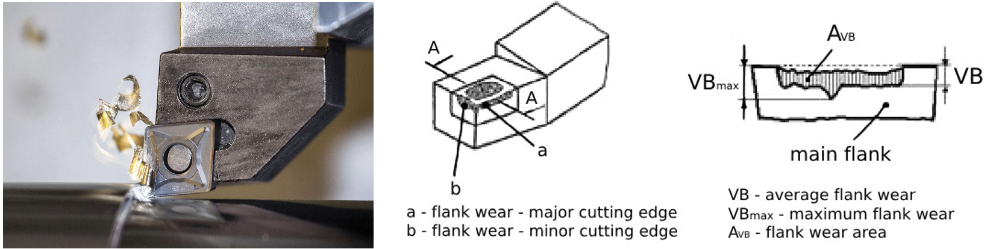
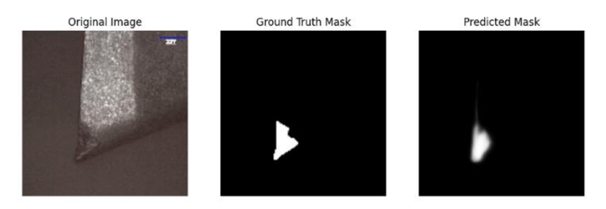
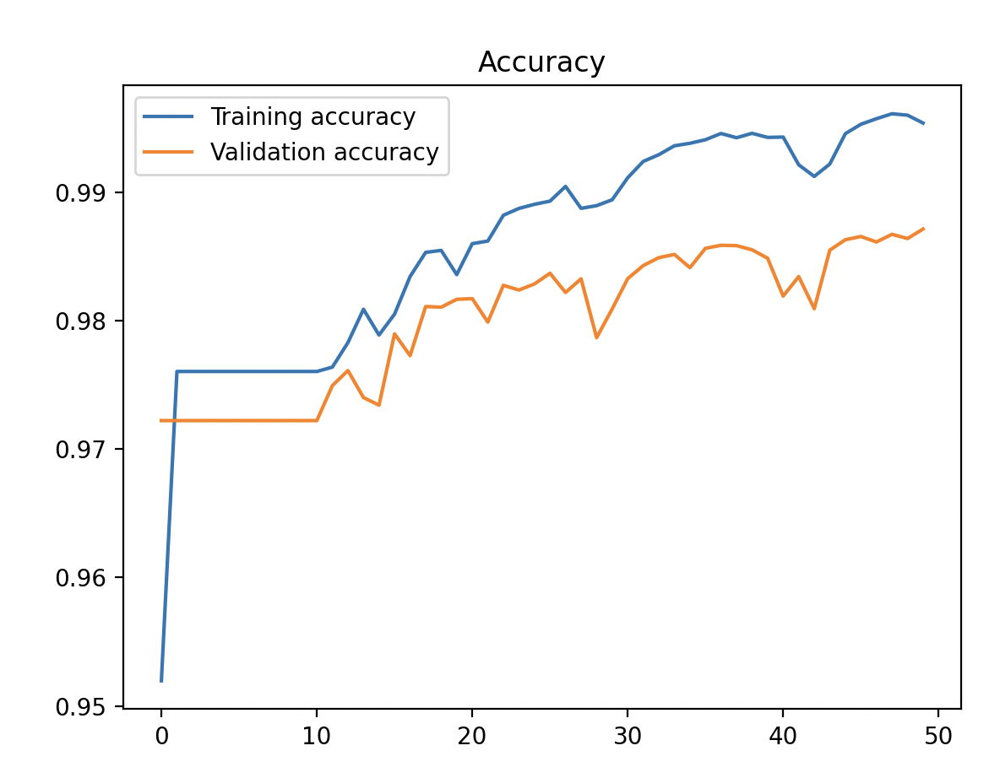
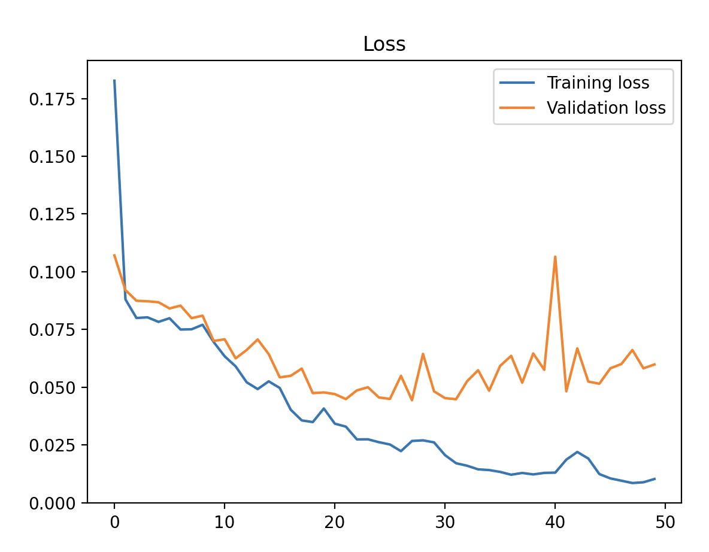
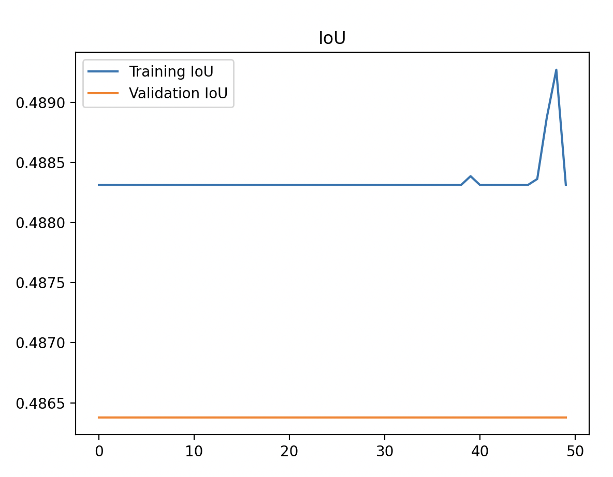

# ToolWearNet - Machining Tool Wear Monitoring Using Deep Learning

## Problem Description

Machining tools are critical components in industrial manufacturing processes, but over time, these tools are subject to wear and tear, leading to inefficiencies, decreased product quality, and increased operational costs. Tool failure or excessive wear can result in tool waste, unplanned downtime, and loss of productivity.

To optimize machining operations and minimize waste, it is important to monitor tool wear, especially the <u>flank wear</u> (VBmax), and schedule maintenance before failure occurs. Traditional methods of monitoring are often more complicated, inderect, and do measure VBmax. **ToolWearNet**, aims to automate the process using deep learning to detect and measure machining tool wear from images.

By predicting wear levels in real-time, this project helps reduce waste, optimize tool usage, and make maintenance schedules more efficient, ultimately improving manufacturing sustainability.



## Project Overview



**ToolWearNet** uses a convolutional neural network (CNN) in U-Net architecture to analyze images of machining tools and highlight wear, with main focus on determining the VBmax value, which is a critical parameter for evaluating tool wear. The project includes scripts for data preprocessing, image augmentation, and model training/testing, loading a tool image, predicting the wear mask, and post processing for determining the max flank wear on the tool.


## Result Graphs

<p align="center">
  
  
  
</p>

## Features

- Detect and measure flank wear (VBmax) on machining tools.
- Use deep learning models to predict wear levels from images.
- Automated image preprocessing and augmentation to improve model accuracy.
- Easily train and test models with provided scripts.

## Installation and Dependencies

### 1. Clone the repository

```bash
git clone https://github.com/MikeAchoy/ToolWearNet.git
cd ToolWearNet
```

### 2. Create a Python virtual environment

It is recommended to use a virtual environment to manage dependencies. You can create one using the following command:

```bash
python3 -m venv env
```

Activate the environment:

- **On macOS/Linux**:

    ```bash
    source env/bin/activate
    ```

- **On Windows**:

    ```bash
    .\env\Scripts\activate
    ```

### 3. Install dependencies

To install the required dependencies, run:

```bash
pip install -r requirements.txt
```

Alternatively, you can install the necessary packages manually using:

```bash
pip install numpy opencv-python matplotlib tensorflow
```

## Project Dependencies

- **NumPy**: For numerical computations and array operations.
- **OpenCV**: For image processing and manipulation.
- **Matplotlib**: For plotting and visualizing data and images.
- **TensorFlow**: For building and training the deep learning models.
- **Keras**: Used within TensorFlow for high-level deep learning model APIs.


## Usage

### 1. Dataset Preparation

Ensure that your images for training and testing are properly organized into separate folders and labeled correctly for the machine learning model to learn effectively.

Placeholders for dataset images:
- `images/train`: Contains training images of the machining tools with varying levels of wear.
- `images/test`: Contains testing images of the machining tools.

### 2. Data Augmentation

We use `ImageDataGenerator` from Keras for real-time data augmentation, such as flipping, rotating, and scaling, to make the model more robust and improve its accuracy. This helps the model generalize better when dealing with new data.

```python
datagen = ImageDataGenerator(
    rotation_range=90,
    width_shift_range=0.1,
    height_shift_range=0.1,
    shear_range=0.2,
    zoom_range=0.2,
    horizontal_flip=True,
    vertical_flip=True.
    fill_mode='nearest'
)
```

### 3. Training the Model

Run the script to train the model on your prepared dataset:

```bash
python train_model.py
```

### 4. Testing and Predictions

Use the provided testing script to make predictions on new data:

```bash
python test_model.py
```

## Contributing

Feel free to fork this repository, submit issues, or make pull requests if you have suggestions or improvements!

## License

This project is licensed under the MIT License - see the [LICENSE](LICENSE) file for details.
